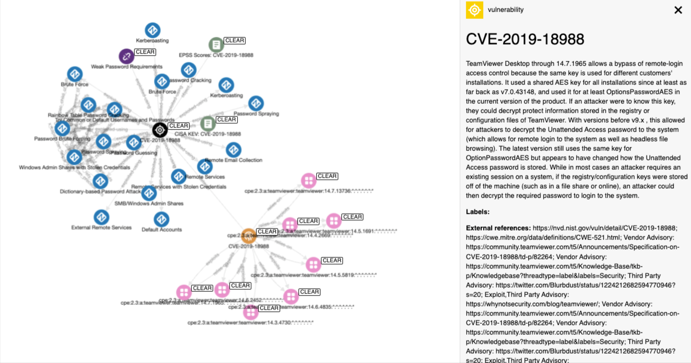

# Arango CVE Processor



A small script that creates relationships between common CVEs to other sources STIX 2.1 format.

## tl;dr


## Overview

Here at DOGESEC we have many repositories that generate STIX objects for different knowledge-bases. Many of these knowledgebases often have some link to another.

We first built [ArangoDB CTI Processor](https://github.com/muchdogesec/arango_cve_processor/) that deals with external knowledgbases.

As we started working with CVE data, we realised we'd need a similar solution for Vulnerability data.

ArangoDB CVE Processor is a script that;

1. reads the ingested CVE/CPE data in ArangoDB
2. creates STIX objects to represent the relationships between CVE/CPEs and other datasets

## Usage

### Install the script

```shell
# clone the latest code
git clone https://github.com/muchdogesec/arango_cve_processor
# create a venv
cd arango_cve_processor
python3 -m venv arango_cve_processor-venv
source arango_cve_processor-venv/bin/activate
# install requirements
pip3 install -r requirements.txt
````

### Configuration options

Arango CVE Processor has various settings that are defined in an `.env` file.

To create a template for the file:

```shell
cp .env.example .env
```

To see more information about how to set the variables, and what they do, read the `.env.markdown` file.

### Run

```shell
python3 arango_cve_processor.py \
    --database DATABASE \
    --relationship RELATIONSHIP \
    --ignore_embedded_relationships BOOLEAN \
    --stix2arango_note STRING \
    --modified_min DATETIME
```

Where;

* `--database` (required): the arangoDB database name where the objects you want to link are found. It must contain the collections required for the `--relationship` option(s) selected
* `--relationship` (optional, dictionary): you can apply updates to certain relationships at run time. Default is all. Note, you should ensure your `database` contains all the required seeded data. User can select from;
  * `cve-cpe`
  * `cve-cwe`
  * `cve-capec`
  * `cve-attack`
  * `cve-epss`
  * `cve-kev`
* `--ignore_embedded_relationships` (optional, boolean). Default is false. if `true` passed, this will stop any embedded relationships from being generated. This is a stix2arango feature where STIX SROs will also be created for `_ref` and `_refs` properties inside each object (e.g. if `_ref` property = `identity--1234` and SRO between the object with the `_ref` property and `identity--1234` will be created). See stix2arango docs for more detail if required, essentially this a wrapper for the same `--ignore_embedded_relationships` setting implemented by stix2arango
* `--stix2arango_note` (optional, string): will be used as a value for `_stix2arango_note` for all objects created by arango_cve_processor
* `--modified_min` (optional, date). By default arango_cve_processor will consider all objects in the database specified with the property `_is_latest==true` (that is; the latest version of the object). Using this flag with a modified time value will further filter the results processed by arango_cve_processor to STIX objects with a `modified` time >= to the value specified. This is most useful in CVE modes, where a high volume of CVEs are published daily.

On each run, only the `_is_latest==true` version of objects will be considered by the script.

### Examples

```shell
python3 arango_cve_processor.py \
  --database arango_cve_processor_standard_tests_database \
  --relationship cve-cwe \
  --modified_min 2023-01-01 \
  --ignore_embedded_relationships true
```

## Backfilling data

[stix2arango contains a set of utility scripts that can be used to backfill all the datasources required for this test](https://github.com/muchdogesec/stix2arango/tree/main/utilities).

## How it works

If you would like to know how the logic of this script works in detail, please consult the `/docs` directory.

## Useful supporting tools

* To generate STIX 2.1 extensions: [stix2 Python Lib](https://stix2.readthedocs.io/en/latest/)
* STIX 2.1 specifications for objects: [STIX 2.1 docs](https://docs.oasis-open.org/cti/stix/v2.1/stix-v2.1.html)
* [ArangoDB docs](https://www.arangodb.com/docs/stable/)

## Support

[Minimal support provided via the DOGESEC community](https://community.dogesec.com/).

## License

[Apache 2.0](/LICENSE).